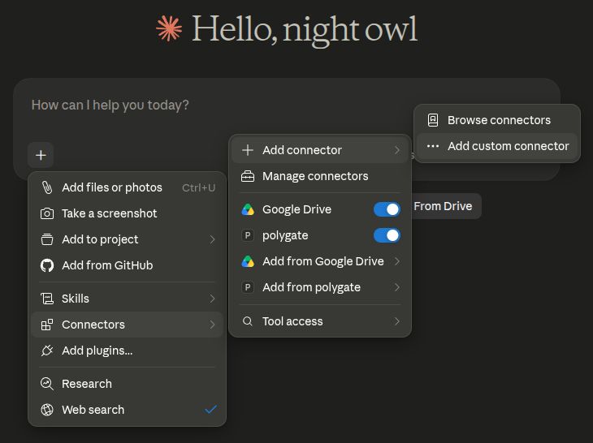
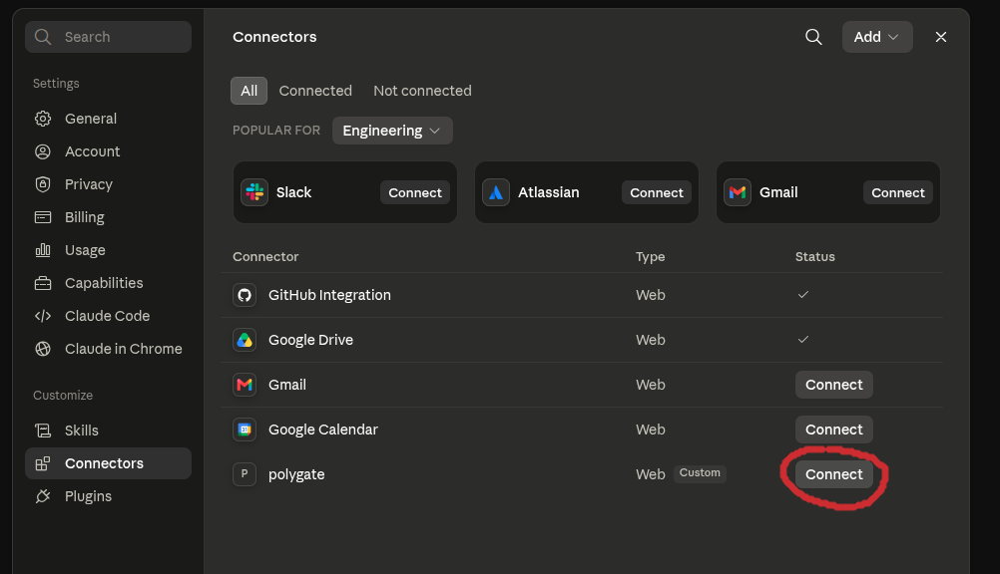
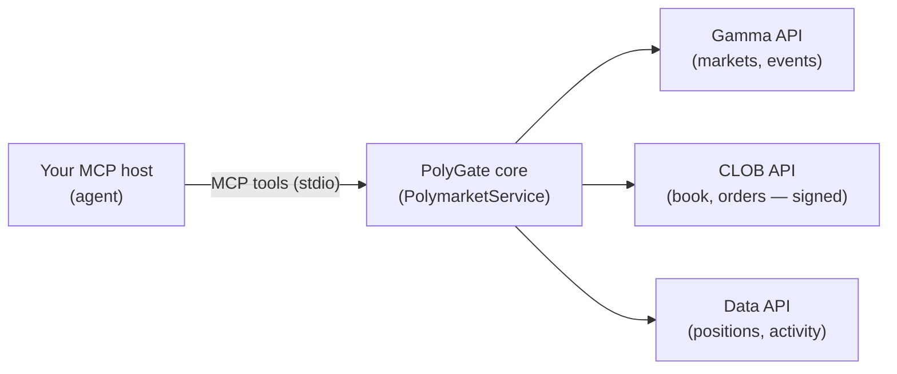

# PolyGate

**Trade [Polymarket](https://polymarket.com) from any LLM that speaks MCP.**

[](LICENSE)


PolyGate is a [Model Context Protocol](https://modelcontextprotocol.io) server
that gives your AI agent Polymarket as a set of tools. Point any MCP-capable host
(Claude Desktop, Claude Code, VS Code, Cursor, OpenClaw, …) at it,
and your agent can:

- **research markets** — search, list, and read events, markets, and resolution rules;
- **read live prices** — order book, midpoint, spread, last trade, price history;
- **inspect your account** — positions, balance, portfolio value, orders, activity;
- **trade** — buy, sell, and manage real orders on your own Polymarket account.

It uses **your** Polymarket account. Researching and reading markets needs no
credentials — run it key-free to explore. To let the agent **trade**, you supply
two values (your funding address and signer key); PolyGate then signs orders,
derives credentials, and detects your signature type for you — all in memory at
startup. There's no HTTP
server to run, no port to open, and no API key for the agent to manage. All your trades
will also be visible on Polymarket.com, and you can use the site to manage your account as usual.

> **Real money.** Once your funded wallet is configured, the trading tools spend
> real funds on your Polymarket account.

## Quick start

The only requirement is **[uv](https://docs.astral.sh/uv/)**. Install it for your
platform:

<details open>
<summary><b>macOS</b></summary>

```bash
curl -LsSf https://astral.sh/uv/install.sh | sh
```

Or with [Homebrew](https://brew.sh): `brew install uv`.
</details>

<details>
<summary><b>Linux</b></summary>

```bash
curl -LsSf https://astral.sh/uv/install.sh | sh
```
</details>

<details>
<summary><b>Windows</b></summary>

```powershell
powershell -ExecutionPolicy ByPass -c "irm https://astral.sh/uv/install.ps1 | iex"
```

Or with [winget](https://learn.microsoft.com/windows/package-manager/):
`winget install --id=astral-sh.uv -e`.
</details>

`uvx` (bundled with uv) then fetches and runs PolyGate on demand, with no clone or
`pip install`.

To **research and read** markets — no Polymarket account or keys needed — paste
this into your MCP host's config:

```json
{
  "mcpServers": {
    "polygate": {
      "command": "uvx",
      "args": ["--from", "git+https://github.com/ilmari99/polygate@v0.3.0", "polygate-mcp"]
    }
  }
}
```

Reload your host and the market-data, price, and research tools appear.

### Connect a web AI

Use `polygate connect` when the AI runs in a website (ChatGPT, Claude, Grok,
etc.) and needs a public HTTPS MCP URL plus OAuth credentials instead of a local
stdio command.

Install the two command-line dependencies:

| OS | Install `uv` | Install `cloudflared` tunnel |
| --- | --- | --- |
| macOS | `brew install uv` or the installer above | `brew install cloudflared` |
| Windows | `winget install --id=astral-sh.uv -e` | `winget install --id Cloudflare.cloudflared` |
| Linux | `curl -LsSf https://astral.sh/uv/install.sh \| sh` | Debian/Ubuntu: download Cloudflare's latest `cloudflared-linux-amd64.deb` and run `sudo dpkg -i cloudflared-linux-amd64.deb`; Fedora/RHEL: install the latest `cloudflared-linux-x86_64.rpm` with `sudo rpm -i ...` |

Then run:

```bash
uvx --from git+https://github.com/ilmari99/polygate@v0.3.0 polygate connect
```

PolyGate starts a loopback HTTP MCP server, opens a temporary Cloudflare HTTPS
tunnel, provisions OAuth client credentials, and prints a connection card:

```text
MCP URL / Server URL:         https://random.trycloudflare.com/mcp
Client ID / OAuth ID:         polygate-...
Client secret / OAuth secret: pg_secret_...   (treat this like a password)
Mode:                         RESEARCH ONLY
```

In your web AI's custom connector screen, paste the card's **MCP URL**,
**Client ID**, and **Client secret**:

- **ChatGPT**: enable developer/custom connectors, add an MCP server, then use
  the card's **MCP URL** as the server URL and the **Client ID** / **Client
  secret** as the user-defined OAuth client.
- **Claude**: follow the step-by-step walkthrough below.
- **Grok**: create a custom remote MCP connector, paste the **MCP URL**, and use
  the card's **Client ID** and **Client secret** for OAuth.

#### Add PolyGate to Claude (web)

Keep the `polygate connect` terminal open so its connection card stays visible,
then in [claude.ai](https://claude.ai):

1. Click the **+** button at the bottom-left of the chat box, then choose
   **Connectors → Add connector → Add custom connector**.

   

2. In the dialog, paste the three values from the connection card: the **MCP URL**
   (e.g. `https://random.trycloudflare.com/mcp`) as the server URL, and the
   **Client ID** and **Client secret** as the OAuth client credentials. Save.

3. Open the **+** menu again and choose **Connectors → Manage connectors**, then
   click **Connect** next to **polygate**. Claude opens the authorization page —
   click **Authorize** to finish.

   

PolyGate's research tools now appear in Claude. If you enabled trading, the
place/cancel-order tools appear too.

The command runs until Ctrl-C, which stops the tunnel and disconnects the web AI.
Re-running reuses the same OAuth credentials; use `--new-credentials` to rotate
them. Trading is off by default even if you have a wallet configured. To allow
real orders, first run `polygate setup`, then run `polygate connect
--allow-trading` and type the confirmation phrase shown in the terminal.

### Add your wallet to trade

Credentials are needed **only for trading**. To let the agent place and cancel
orders on **your** Polymarket account, add an `env` block with two values from
[polymarket.com](https://polymarket.com):

- **Funder address** — Settings → Profile → Address (`0x…`).
- **Private key** — Settings → Account → Private Key. **Keep it secret.**

```json
{
  "mcpServers": {
    "polygate": {
      "command": "uvx",
      "args": ["--from", "git+https://github.com/ilmari99/polygate@v0.3.0", "polygate-mcp"],
      "env": {
        "FUNDER_ADDRESS": "0xYourFundingAddress",
        "PRIVATE_KEY": "0xYourSignerPrivateKey"
      }
    }
  }
}
```

These are environment variables your host passes to the PolyGate process; they
stay in a local config file on your machine.

This `mcpServers` shape is the de-facto standard and works in Claude Desktop,
Claude Code, Cursor, and most MCP hosts. **VS Code is the exception** — see
[Other hosts](#other-hosts) below.

## Talk to your agent

Once the tools are loaded, just ask anything about Polymarket. For example:

- "Find the most-traded live markets right now."
- "Suggest markets where there is an edge and latest news havent been priced in correctly."
- "How is my portfolio performing?"
- "Buy 500 YES shares for France winning the World Cup."

> Want the model to understand *how* to trade before it starts — Polymarket's
> tokens-vs-markets model, the price-is-probability idea, common footguns, and
> keeping a memory of what it learns — hand it [`llm.md`](llm.md), an optional
> briefing written for the agent.

## Navigating Polymarket

Polymarket has one containment and two cross-cutting groupings — PolyGate exposes
each so an agent can find *everything*, not just what full-text search surfaces:

- **Market** — the atomic tradable question (a `0x…` `conditionId`, its
  `clobTokenIds`). Prices and orders are always per outcome token.
- **Event** — a "market page" grouping one or more markets.
- **Tags** and **Series** — two independent groupings *over* events. Tags are flat
  categories; a **series** is a recurring or multi-part set (each Fed decision, a
  monthly BTC strike ladder, a tournament's fixtures). `gameId` is not a level — it
  is a sports-only *attribute* that a game's sibling events share.

Because Polymarket splits one topic across several separate events (a match's
moneyline, spread, and totals are distinct events), opening one event or searching
shows only a fragment. Two ways to navigate:

- **Deepen:** `list_tags` / `list_series` → `list_events(tag_id=/series_id=)` →
  `get_event` → its markets.
- **Flatten:** `collect_markets(series_id=|tag_id=|event=)` returns every atomic
  market under one scope in a single list. For a sports game,
  `collect_markets(event=<slug>, group_by="gameId")` gathers all its sub-markets at
  once.

## How it works

Every tool is a thin wrapper over one in-process core, `PolymarketService`, which
owns all upstream access:



Trading on Polymarket involves two addresses, and you provide both:

- **Your signer** (`PRIVATE_KEY`) — an ordinary Ethereum keypair whose private key
  **signs** your orders. This is the key polymarket.com reveals under
  **Settings → Account → Private Key**; if you connected your own wallet, it's that
  wallet's key. Either way you don't need a new wallet.
- **Your funder** (`FUNDER_ADDRESS`) — the Polymarket account that actually
  **holds your USDC** and is the order maker. Your signer controls it; you never
  get a separate key.

At startup the core derives your CLOB API credentials from the signer key and
**auto-detects your order signature type** — whichever of proxy wallet, connected
(Safe) wallet, deposit wallet, or plain EOA holds your funds (you need to have funds) — so orders are signed
correctly with no on-chain setup, token allowances, or separate RPC. Because the
wallet is passed in fresh through the `env` block each start, these credentials are
derived in memory and **never written elsewhere**.

The core only **reads market/account data** and **places orders**. It does
not manage your wallet, handle deposits or withdrawals, sign any transaction other
than an order, or contain any trading logic. It's an abstraction over
Polymarket's APIs so you can build your own agent, without losing any
features inherent to the Polymarket platform.

## Configuration

All settings are environment variables set in the `env` block of your MCP config
(as in the Quick start):

| Variable          | Required | Description                                              |
| ----------------- | :------: | -------------------------------------------------------- |
| `PRIVATE_KEY`     | for trading | Signer key. **Keep secret.** |
| `FUNDER_ADDRESS`  | for trading | The address that holds your funds and makes your orders. |
| `DRY_RUN`         |    no    | `true` simulates orders without signing or sending them. |
| `LOG_LEVEL`       |    no    | Logging level (default `INFO`).                          |
| `SIGNATURE_TYPE`, `CLOB_API_KEY`, `CLOB_SECRET`, `CLOB_PASSPHRASE` | auto | Derived/detected in memory at startup; set only to override. |

Market-data and research tools (`list_markets`, `get_order_book`, `collect_markets`,
`search`, `get_holders`, …) work **without a wallet**. Account and trading tools
(`get_positions`, `get_balance`, `place_order`, `cancel_order`, …) require
`PRIVATE_KEY` and `FUNDER_ADDRESS`. Use `DRY_RUN=true` to exercise `place_order`
safely.

> Prices and orders are always per **outcome token** (`clobTokenId`), never per
> market. A share pays $1 if its outcome happens and $0 if not, so a token's price
> is the market's implied probability.

## Other hosts

The Quick-start JSON works as-is for Claude Desktop, Claude Code, Cursor, and most
MCP hosts. Two cases differ:

**VS Code (Copilot)** uses a `servers` key (not `mcpServers`) and a `type` field.
Put this in `.vscode/mcp.json`, then reload the window:

```json
{
  "servers": {
    "polygate": {
      "type": "stdio",
      "command": "uvx",
      "args": ["--from", "git+https://github.com/ilmari99/polygate@v0.3.0", "polygate-mcp"],
      "env": {
        "FUNDER_ADDRESS": "0xYourFundingAddress",
        "PRIVATE_KEY": "0xYourSignerPrivateKey"
      }
    }
  }
}
```

**Running your own checkout** (while developing PolyGate): point `--from` at a
local path instead of the git URL — `uvx --from /path/to/polygate polygate-mcp`.

## Optional: REST gateway for algorithmic trading

The same core is also exposed as a language-agnostic **REST gateway** (FastAPI),
for clients that aren't MCP hosts — e.g. an algorithmic trading bot in another
language that drives PolyGate over plain HTTP. It offers identical capabilities,
protected by a generated `PLATFORM_API_KEY`.

```bash
git clone https://github.com/ilmari99/polygate.git && cd polygate
python -m venv .venv && source .venv/bin/activate
pip install .
polygate        # serves http://127.0.0.1:8000, interactive docs at /docs
```

Connect your wallet at `http://127.0.0.1:8000/setup` (on your own machine) or with
`polygate setup` (remote/SSH), then drive it over HTTP.
[examples/sample_agent.py](examples/sample_agent.py) is a runnable, dependency-free
reference for the read → decide → order loop, and the full endpoint reference is at
`/docs` once the server is running.

## Development

```bash
git clone https://github.com/ilmari99/polygate.git && cd polygate
pip install ".[dev]"
pytest -q
```

The suite runs fully offline (HTTP is mocked) and exercises the `DRY_RUN` switch,
which simulates orders without signing or sending them.

## Safety

- Your `PRIVATE_KEY` controls your funds. It lives in the `env` block of your MCP
  config, in a local file on your own machine — that's fine; just don't commit a
  config file containing it to a shared or public repository. Exposing the `PRIVATE_KEY` publicly risks your funds.
- Trading tools spend real money once a funded wallet is configured. Keep
  `DRY_RUN=true` while testing, and have your agent confirm orders before placing.

## License

MIT — see [LICENSE](LICENSE).
